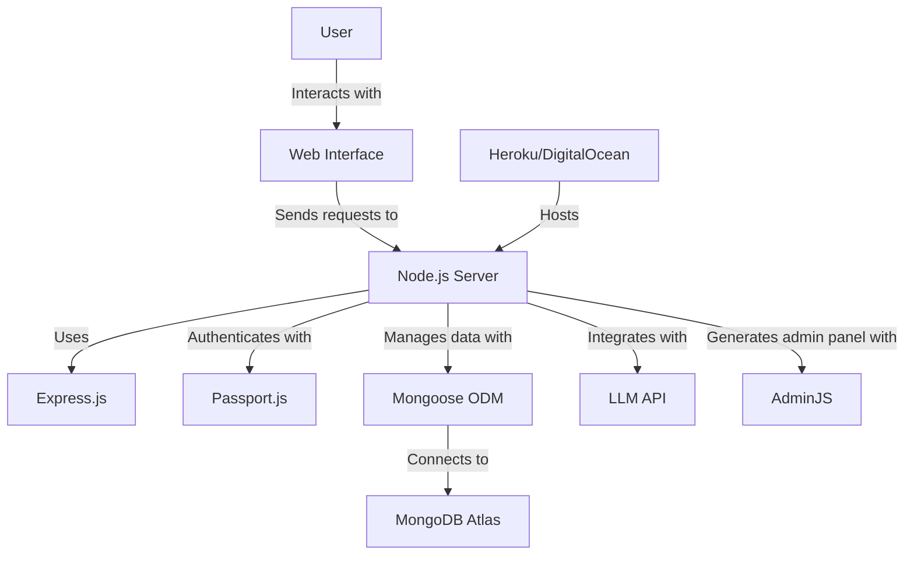
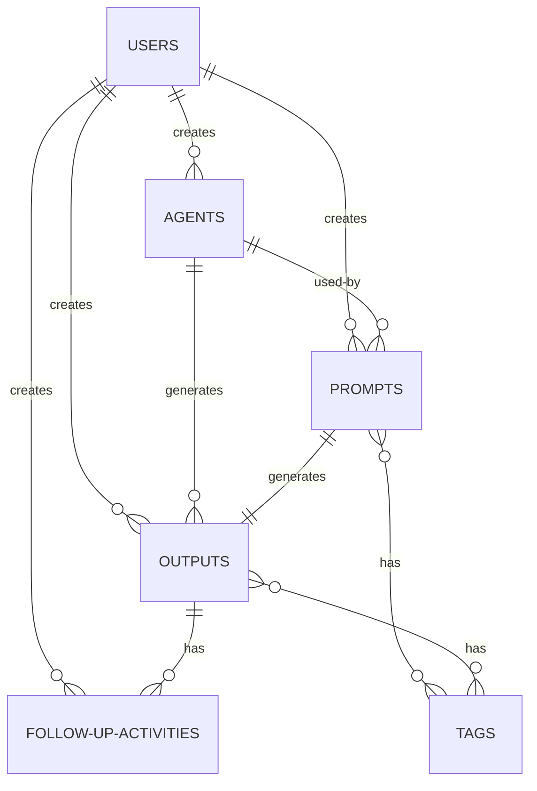
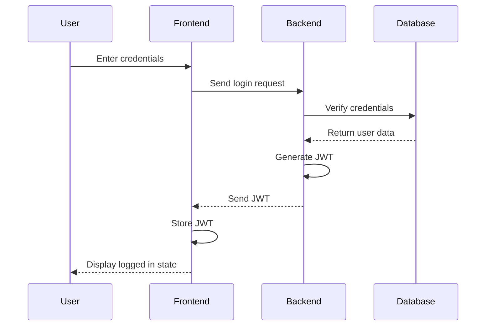
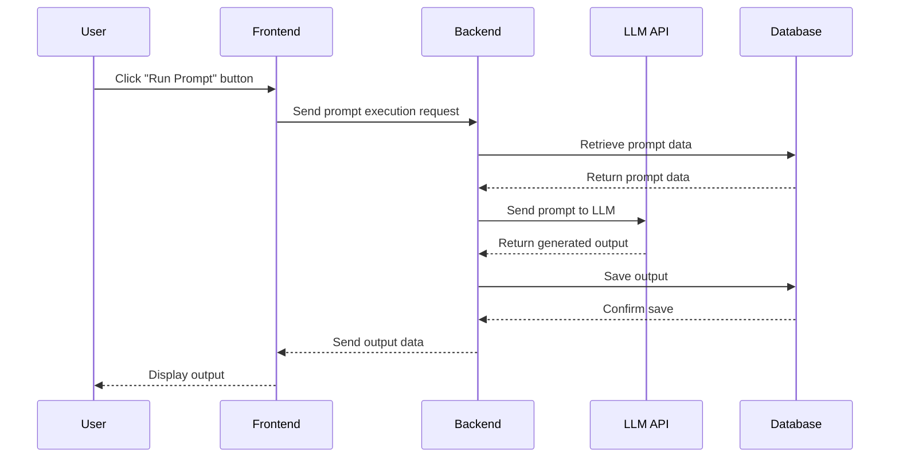

*Note: this repository consists of the outputs of large language models (LLMs). In many cases, these are unedited or minimally edited. The information provided is for demonstrative purposes only and is intended to highlight constraints and capabilities in LLM applications and prompt engineering strategies.*

# Prompt

Great. How about we try to add a few diagrams to this. I know that you can't directly generate them but are you able to generate codeblocks for Mermaid that I can then run? If you can, please generate a few diagrams that will be helpful in explaining the architecture and the connections between the collections

# Output

Certainly! I'd be happy to provide you with Mermaid codeblocks for diagrams that can help explain the architecture and connections between collections in your Output Hub project. Here are a few diagrams that should be helpful:

1. System Architecture Diagram:

2. Data Model and Relationships:

3. Authentication Flow:

4. Prompt Execution Flow:

These Mermaid diagrams should provide a visual representation of:

1. The overall system architecture
2. The data model and relationships between collections
3. The authentication flow
4. The process of executing a prompt and saving its output

You can copy these codeblocks and paste them into a Mermaid-compatible renderer to generate the actual diagrams. These visuals should help in explaining the structure and flow of your Output Hub project.

# More Diagrams

## Extracted Prompts
[[Prompts/Asking program to create Mermaid diagrams.md#Prompt 1|Prompt 1]]
