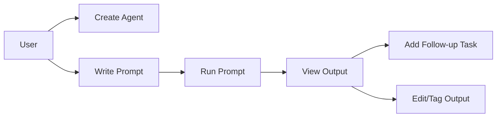
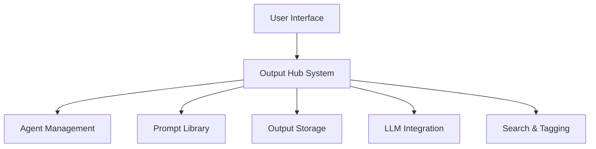
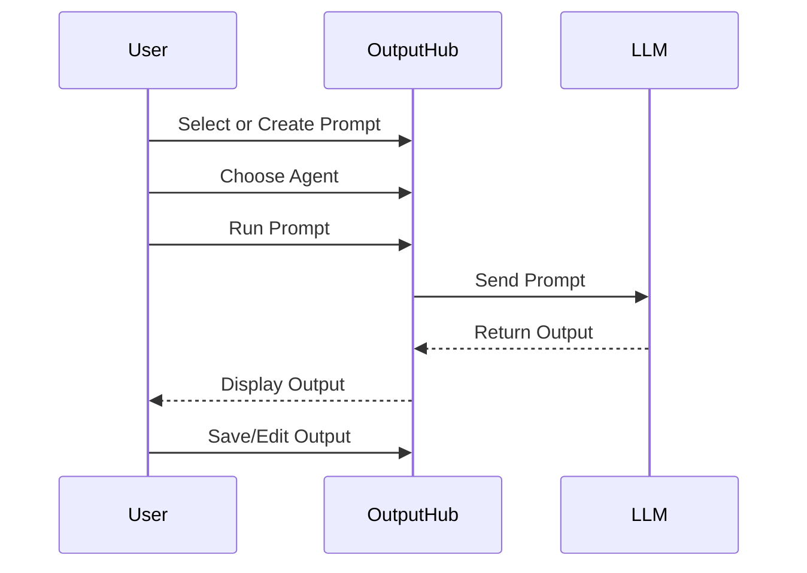
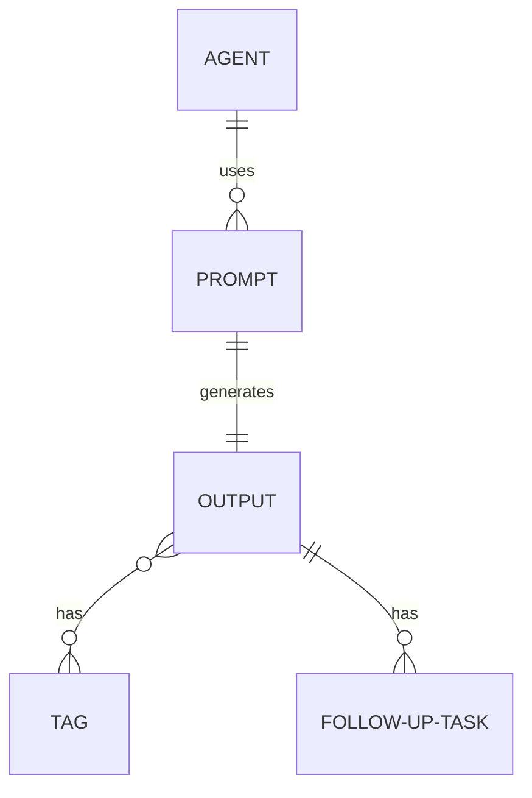
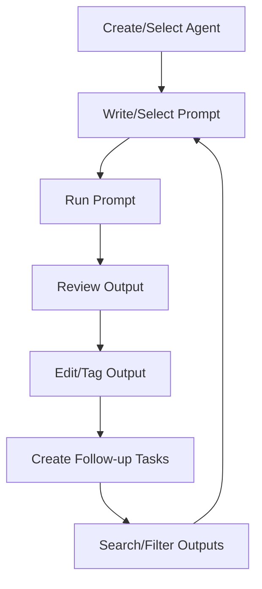

*Note: this repository consists of the outputs of large language models (LLMs). In many cases, these are unedited or minimally edited. The information provided is for demonstrative purposes only and is intended to highlight constraints and capabilities in LLM applications and prompt engineering strategies.*

# Prompt

These were great. But can you create a few more simple diagrams that are intended to provide a high level overview of how the system will work? Imagine that they're for potential users. We don't need to know all the details. But we'd like to know how the system will work

# Output

Certainly! I'd be happy to create some high-level, user-friendly diagrams to provide an overview of how the Output Hub system will work. Here are a few simple Mermaid diagrams that should help potential users understand the system:

1. Basic User Workflow:

2. High-Level System Overview:

3. Prompt Execution Flow:

4. Data Relationship Simplified:

5. User Interaction Cycle:

These diagrams provide a high-level overview of the Output Hub system, focusing on the user's perspective and the main functionalities. They illustrate:

1. The basic workflow a user might follow
2. The main components of the system
3. How a prompt is executed and an output is generated
4. The simplified relationships between different data entities
5. The cyclical nature of user interaction with the system

These visuals should help potential users understand how they would interact with Output Hub and the value it provides in managing LLM interactions, without delving into technical details.

## Extracted Prompts
[[Prompts/Can you provide more simple diagrams describing user flow.md#Prompt 1|Prompt 1]]
