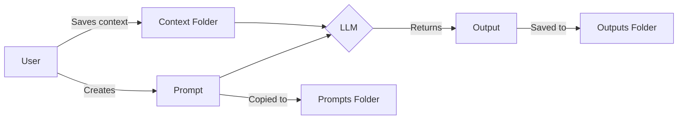
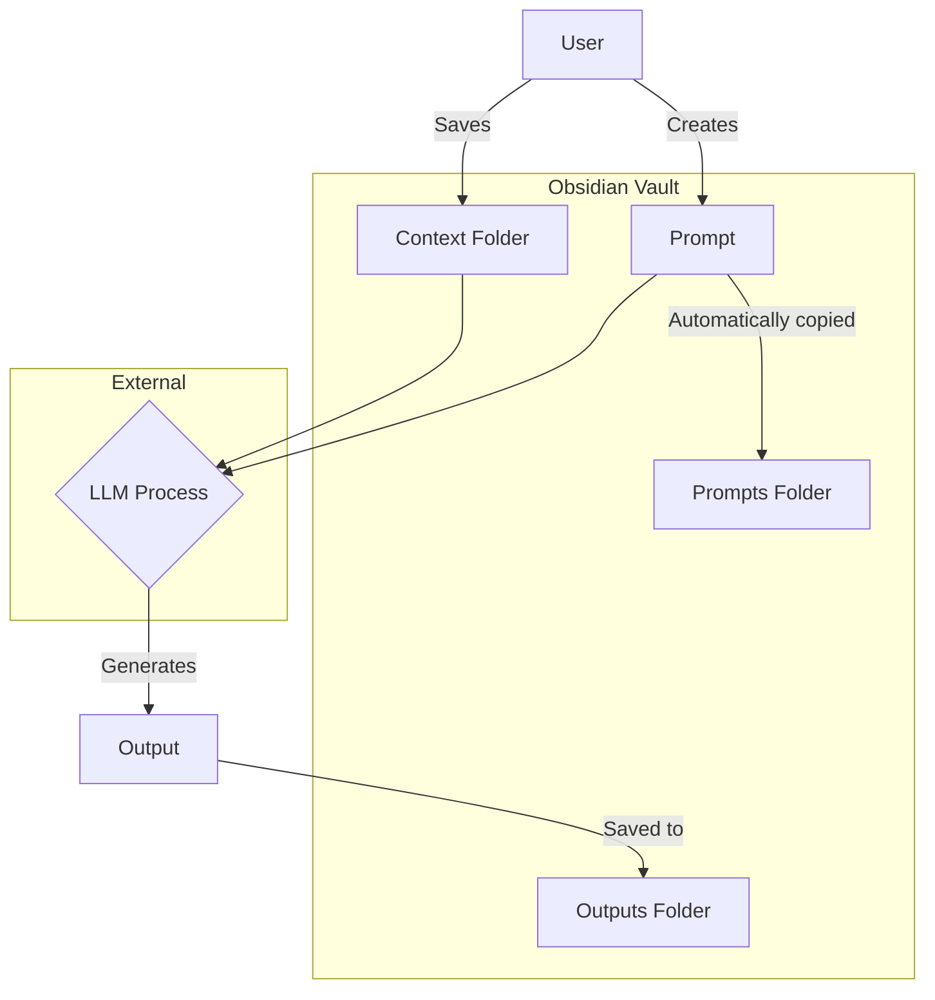
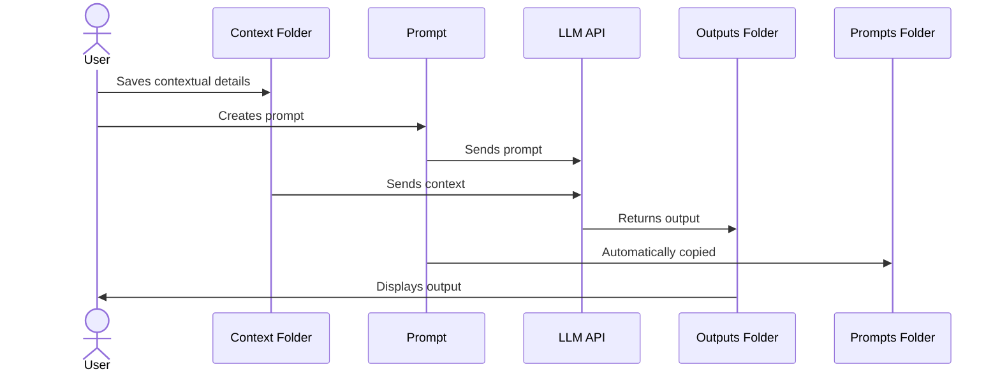

*Note: this repository consists of the outputs of large language models (LLMs). In many cases, these are unedited or minimally edited. The information provided is for demonstrative purposes only and is intended to highlight constraints and capabilities in LLM applications and prompt engineering strategies.*

# Prompt

Please create a few drafts of a mermaid diagram to explain the following flow in my Obsidian vault for managing LLM outputs.

The user saves contextual details into a context folder

The context folder and the prompts are sent to an LLM

The LLM returns an output that is captured in the outputs folder

The prompt is automatically copied and saved into the prompts folder

# Output

Certainly! I'll create a few drafts of Mermaid diagrams to explain the flow in your Obsidian vault for managing LLM outputs, including the context folder and LLM interaction. Here are three different approaches:

1. Simple Linear Flow:

2. Detailed Process Flow:

3. Sequence Diagram:

These diagrams provide different perspectives on the flow of your Obsidian vault management system for LLM outputs, including the context folder and LLM interaction. The first is a simple linear flow, the second provides more detail about the process and the structure of the Obsidian vault, and the third shows the sequence of events. You can choose the one that best represents your system or use them as a starting point for further refinement.

 

## Extracted Prompts
[[Prompts/Context folder diagrams.md#Prompt 1|Prompt 1]]
