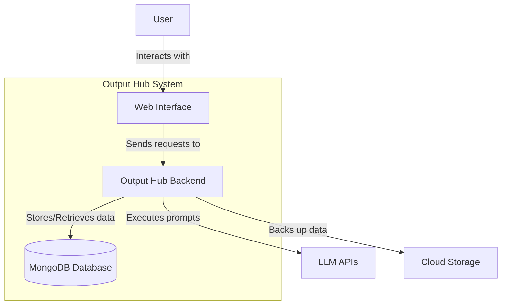
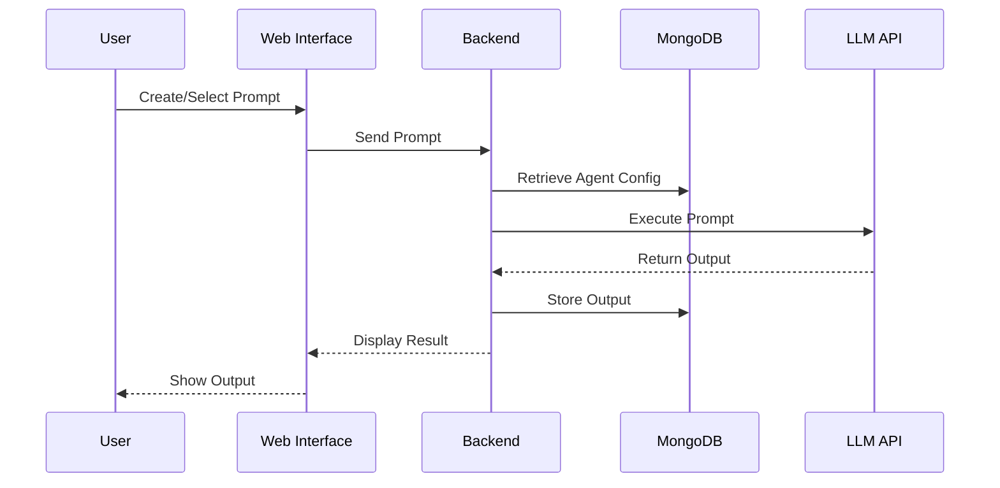
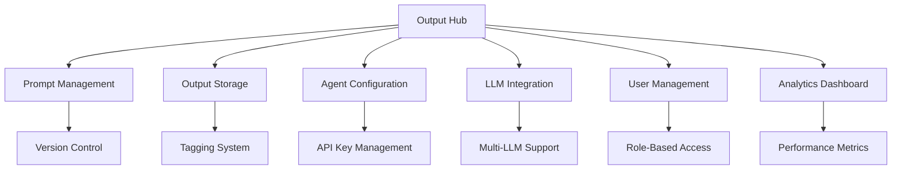

*Note: this repository consists of the outputs of large language models (LLMs). In many cases, these are unedited or minimally edited. The information provided is for demonstrative purposes only and is intended to highlight constraints and capabilities in LLM applications and prompt engineering strategies.*

# Prompt

Great work. Could you think of a few mermaid diagrams that might accompany that text? Remember that this would be pitched to a business audience. But they still might want to see some details about the technical architecture

# Output

Certainly! I'd be happy to suggest a few Mermaid diagrams that could accompany your pitch to a business audience while still providing some technical insights. Here are three diagrams that could be useful:

1. High-Level System Architecture:

This diagram shows the overall system architecture, illustrating how users interact with the system and how Output Hub connects to external services.

2. Data Flow for Prompt Execution:

This sequence diagram illustrates the process of executing a prompt, from user input to storing the result.

3. Output Hub Core Components:

This diagram breaks down the core components of Output Hub, showing the main features and their sub-components.

These diagrams provide a visual representation of Output Hub's architecture and functionality, balancing technical detail with business-oriented clarity. They can help potential investors understand the system's structure and capabilities without delving too deeply into technical specifics.

## Extracted Prompts
[[Prompts/Diagrams to accompany the technical pitch.md#Prompt 1|Prompt 1]]
