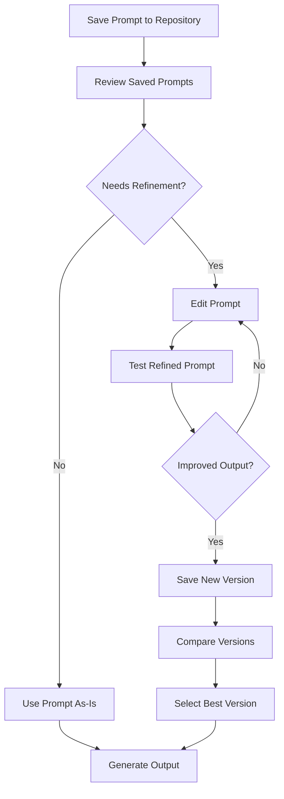
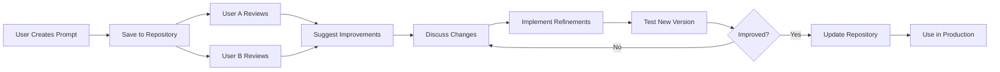
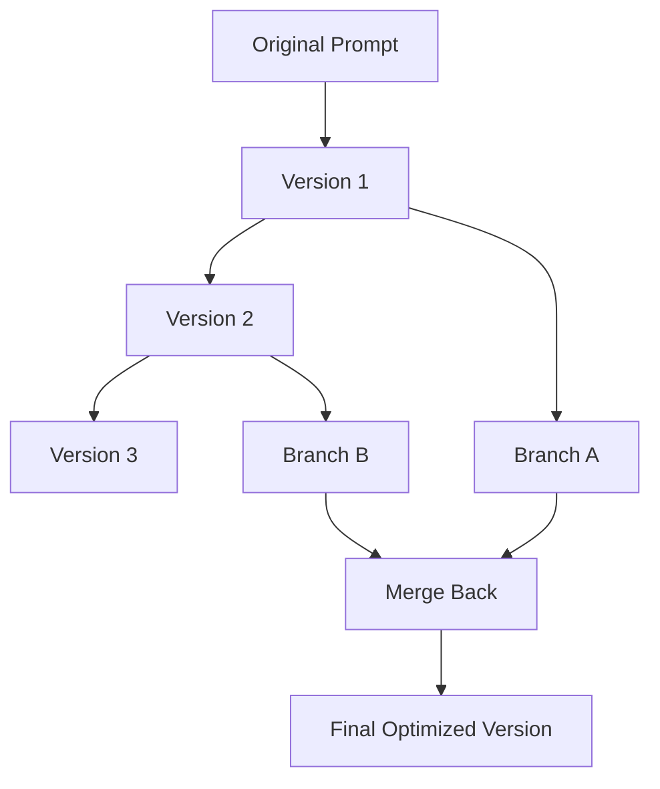
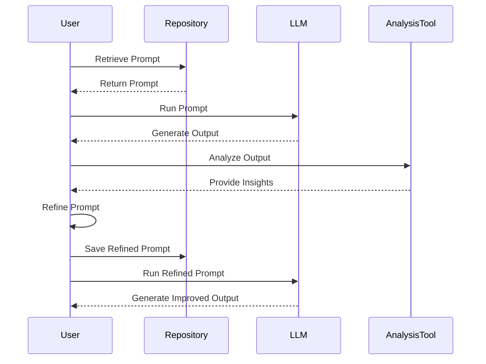
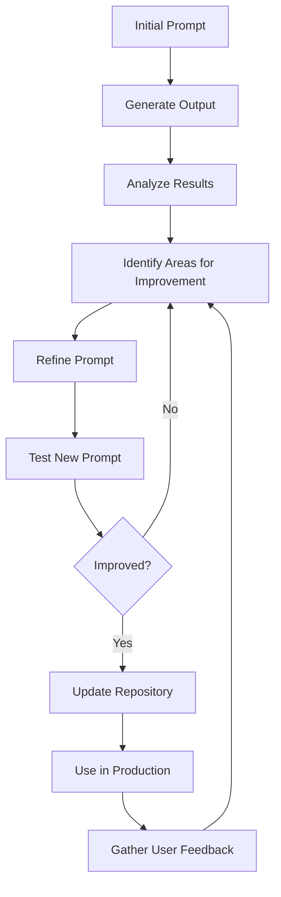

*Note: this repository consists of the outputs of large language models (LLMs). In many cases, these are unedited or minimally edited. The information provided is for demonstrative purposes only and is intended to highlight constraints and capabilities in LLM applications and prompt engineering strategies.*

# Prompt

These were great. Please create some more. highlight the workflow: after the prompts are saved in to the knowledge repository the user might wish to work on them and refine them to yield further value

# Output

Certainly! I'd be happy to create more diagrams that highlight the workflow, especially focusing on how users can work with and refine prompts after they've been saved in the knowledge repository. Here are some new Mermaid diagrams that illustrate this process:

1. Prompt Refinement Workflow:

2. Collaborative Prompt Improvement Cycle:

3. Prompt Version Control Flow:

4. Output Analysis and Prompt Refinement:

5. Continuous Prompt Improvement Cycle:

These diagrams illustrate various aspects of working with and refining prompts after they've been saved in the knowledge repository:

1. The basic workflow of reviewing and refining prompts
2. How multiple users can collaborate to improve prompts
3. The version control aspect of prompt refinement
4. The process of analyzing outputs to inform prompt refinement
5. The continuous cycle of improvement based on results and user feedback

These visuals should help users understand how they can continually work with and improve their prompts to yield better results over time, showcasing the dynamic and iterative nature of prompt engineering within the Output Hub system.

 

## Extracted Prompts
[[Prompts/Diagrams to demonstrate the workflow.md#Prompt 1|Prompt 1]]
