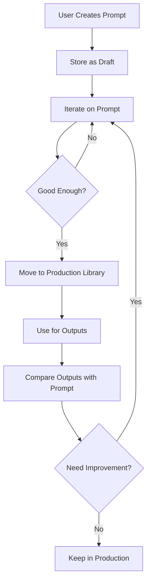
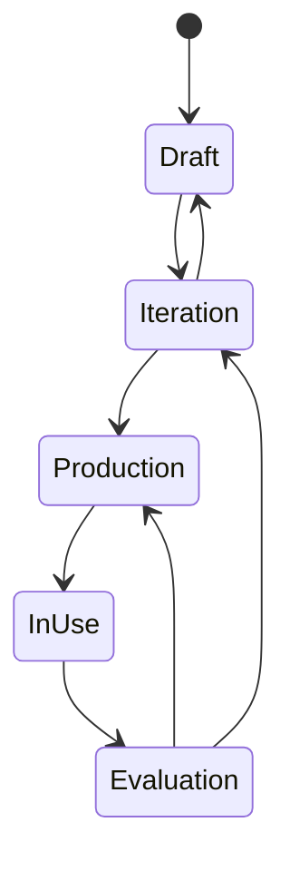
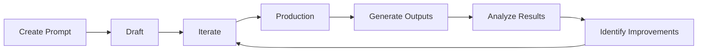
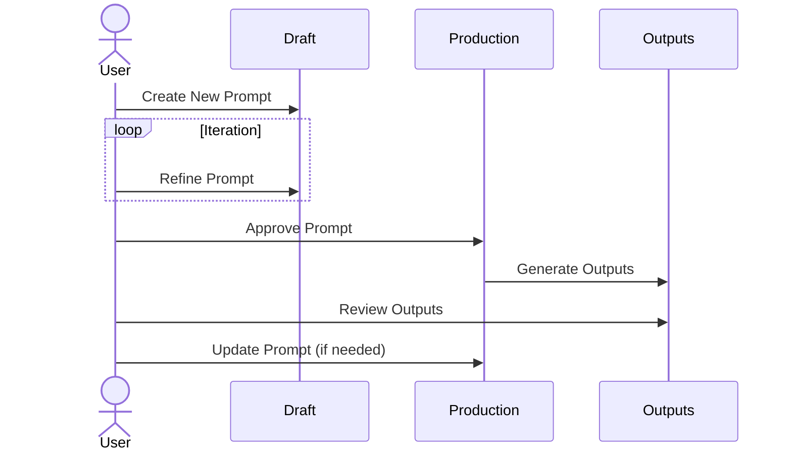

*Note: this repository consists of the outputs of large language models (LLMs). In many cases, these are unedited or minimally edited. The information provided is for demonstrative purposes only and is intended to highlight constraints and capabilities in LLM applications and prompt engineering strategies.*

# Prompt

Please generate a few codeblocks for mermaid diagrams to explain the prompt generation process in Output Hub.

The user wants to create a prompt
The prompt is stored as a draft
The prompt is iterated
When the prompt is good enough, it moves into the production prompt library

Then the prompt can be used for outputs

The outputs and prompt can be compared and in this way the prompt can be iteratively improved

# Output

Certainly! I'll create a few Mermaid diagrams to explain the prompt generation process in Output Hub, focusing on the workflow you've described. Here are the codeblocks for these diagrams:

1. Basic Prompt Creation and Iteration Flow:

2. Prompt Lifecycle:

3. Prompt Improvement Cycle:

4. User Interaction with Prompt System:

These diagrams illustrate the prompt generation process in Output Hub, showing:

1. The overall flow from creation to production use and iterative improvement.
2. The lifecycle states a prompt can be in.
3. The cyclical nature of prompt improvement based on output analysis.
4. The user's interaction with the system throughout the process.

These visualizations should help users understand how prompts are created, refined, and used within the Output Hub system, emphasizing the iterative improvement process based on output analysis.
 

## Extracted Prompts
[[Prompts/Diagrams to explain the prompt improvement cycle.md#Prompt 1|Prompt 1]]
