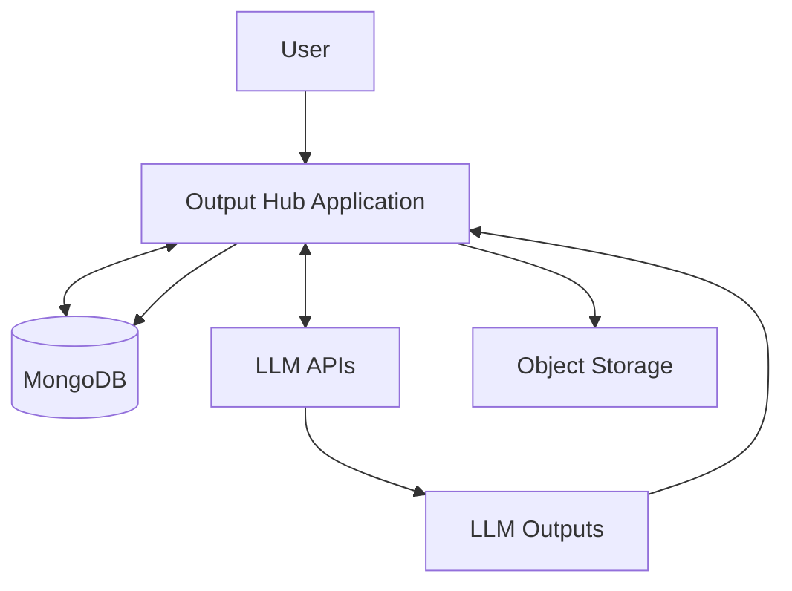
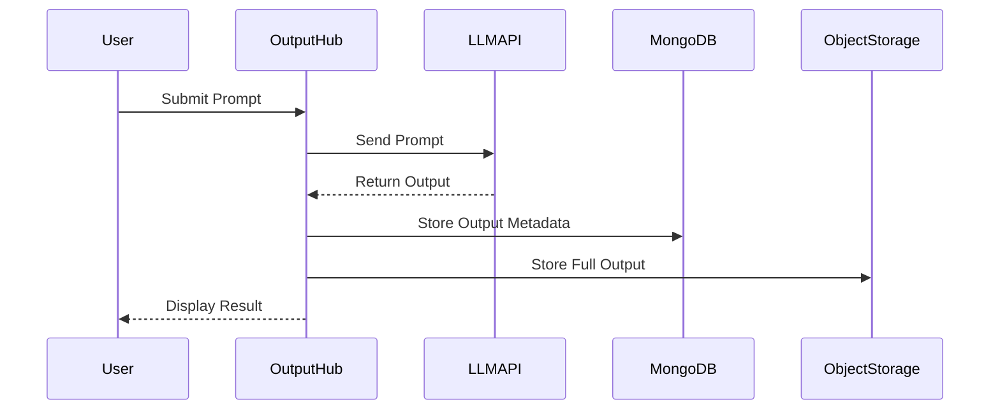
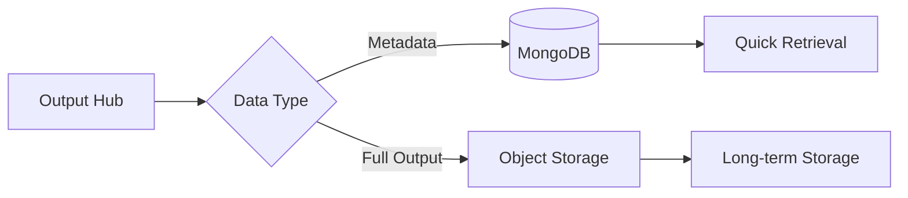
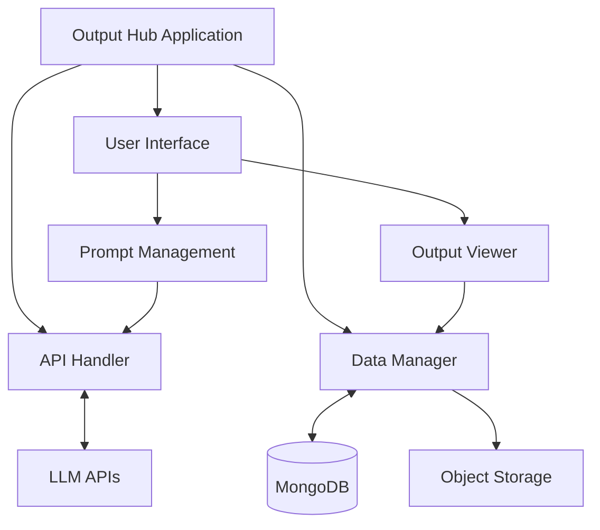

*Note: this repository consists of the outputs of large language models (LLMs). In many cases, these are unedited or minimally edited. The information provided is for demonstrative purposes only and is intended to highlight constraints and capabilities in LLM applications and prompt engineering strategies.*

# Prompt

Please generate a few mermaid diagram codeblocks which outline how some of the key systems work You have Output Hub as the application The database is MongoDB There are calls to and from LLM APIs Outputs from those APIs are entered into the system and then stored in the database Additional files generated in the system are stored in object storage.

# Output

Certainly! I'll create a few Mermaid diagram codeblocks that outline how the key systems in Output Hub work, based on the information you've provided. Here are the diagrams:

1. High-Level System Architecture:

This diagram shows the overall system architecture, including user interaction, database, LLM APIs, and object storage.

2. LLM API Interaction Flow:

This sequence diagram illustrates the flow of a user submitting a prompt, the interaction with the LLM API, and how the output is stored.

3. Data Storage Process:

This diagram shows how different types of data are stored in the system, with metadata in MongoDB for quick retrieval and full outputs in object storage.

4. System Components and Interactions:

This diagram provides a more detailed view of the Output Hub application's components and how they interact with external services.

These diagrams provide a visual representation of how the key systems in Output Hub work together, including the application's interaction with MongoDB, LLM APIs, and object storage. They illustrate the flow of data from user input through API calls to storage and retrieval.

 

## Extracted Prompts
[[Prompts/Diagrams to model the system architecture.md#Prompt 1|Prompt 1]]
