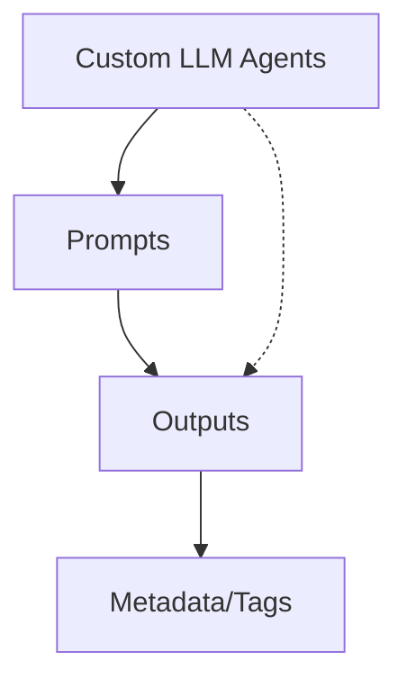
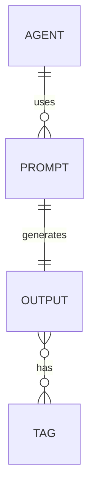
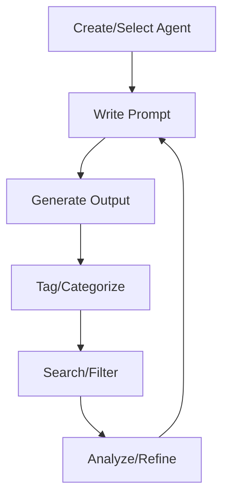
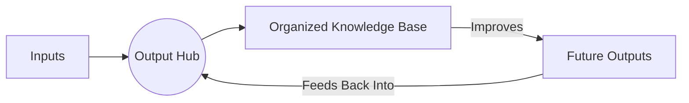
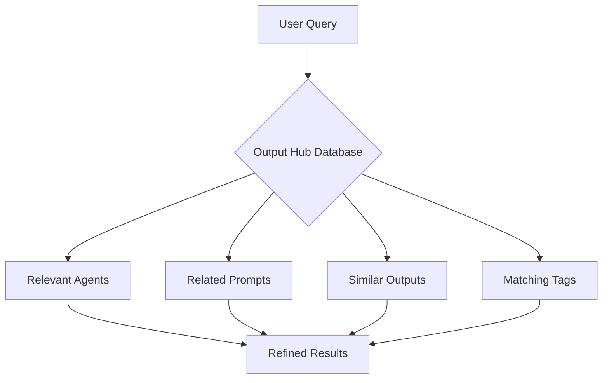

*Note: this repository consists of the outputs of large language models (LLMs). In many cases, these are unedited or minimally edited. The information provided is for demonstrative purposes only and is intended to highlight constraints and capabilities in LLM applications and prompt engineering strategies.*

# Prompt

These were great but still a little bit too complicated.

Let me give you some updated instructions for the Mermaid diagrams:

Please create a few diagrams that focus on providing a high level overview of the Output Hub project.

Focus on explaining the connections between custom LLM agents, prompts, outputs, and associated metadata (you can use tags as an example)

Explain how storing all these data collections and relations in a database system will yield value

# Output

Certainly! I'll create simpler, high-level Mermaid diagrams that focus on the core concepts of the Output Hub project, emphasizing the connections between agents, prompts, outputs, and metadata. These diagrams will illustrate how storing and relating this data can provide value.

1. Core Components of Output Hub:

This diagram shows the basic flow: Agents use Prompts to generate Outputs, which are then tagged with Metadata.

2. Data Relationships:

This simplified entity-relationship diagram shows how Agents, Prompts, Outputs, and Tags are interconnected in the database.

3. Value Creation Cycle:

This diagram illustrates how the system creates value through a cycle of creation, categorization, retrieval, and refinement.

4. Knowledge Base Growth:

This diagram shows how the Output Hub system grows in value over time, as the organized knowledge base improves future outputs.

5. Metadata Enhancing Retrieval:

This diagram illustrates how storing metadata and relationships allows for more refined and relevant retrieval of information.

These simplified diagrams provide a high-level overview of the Output Hub project, focusing on the core components and their relationships. They demonstrate how storing these interconnected data collections in a database system can yield value through improved organization, retrieval, and refinement of LLM-generated content.

 

## Extracted Prompts
[[Prompts/More business focused diagrams.md#Prompt 1|Prompt 1]]
