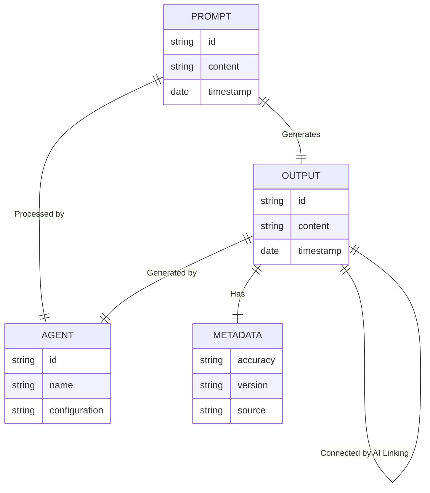
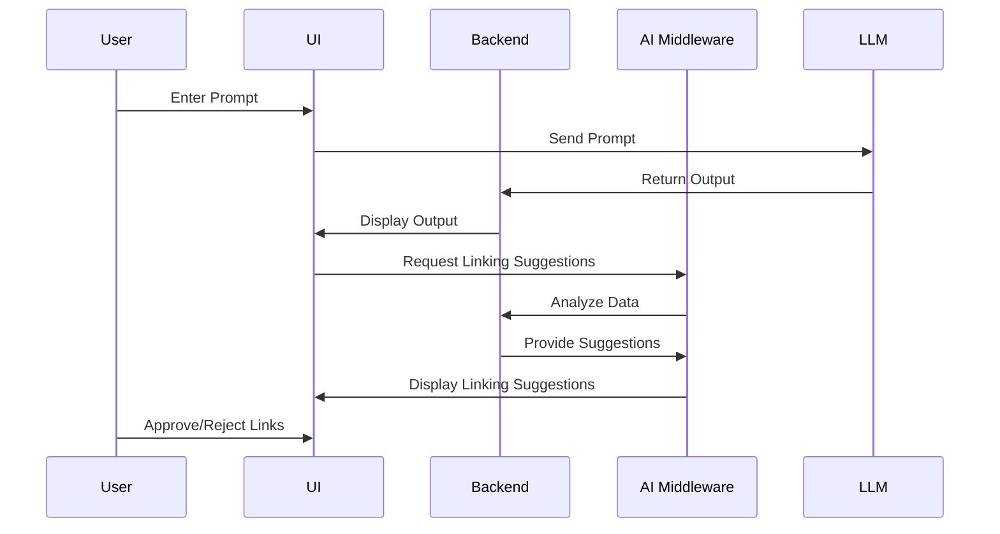
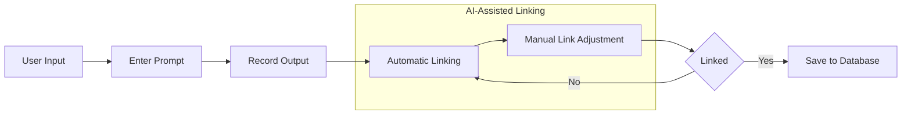
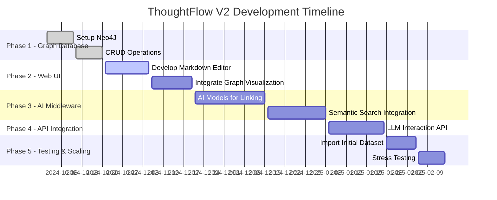
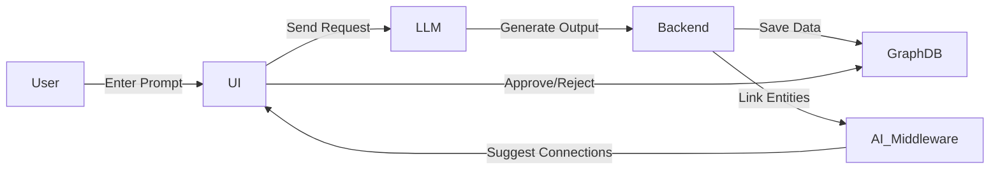
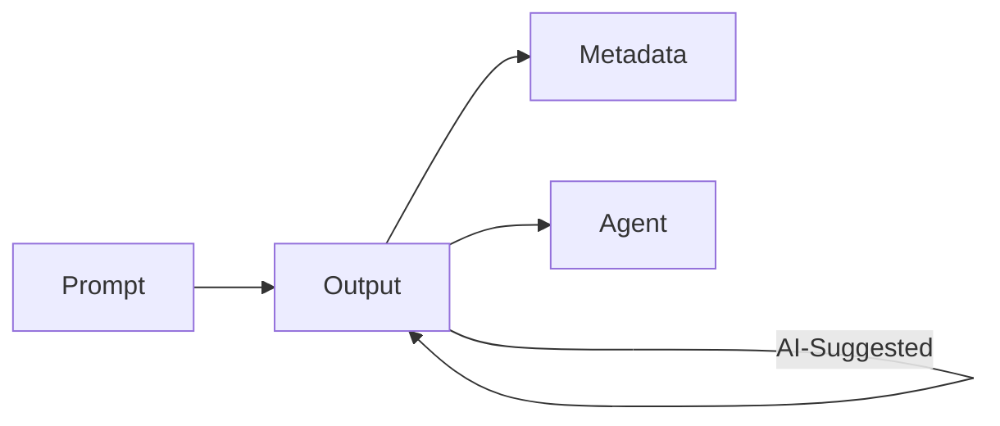
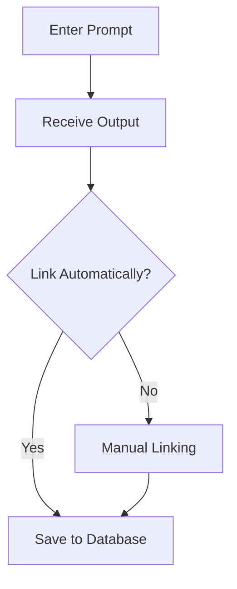
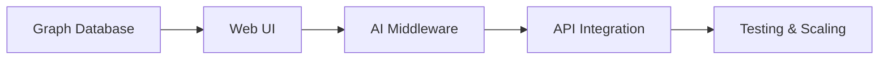

*Note: this repository consists of the outputs of large language models (LLMs). In many cases, these are unedited or minimally edited. The information provided is for demonstrative purposes only and is intended to highlight constraints and capabilities in LLM applications and prompt engineering strategies.*


Your request was to generate mermaid diagrams to visually represent the ideas from the ThoughtFlow V2 document. Based on the content, here are a few suggested diagrams:

### 1. **System Overview - Architecture**
```mermaid
flowchart TD
    A[Frontend] --> B[Web-Based UI]
    B --> C[Markdown Editor]
    B --> D[Graph Visualization]
    B --> E[Search & Retrieval]
    A --> F[Mobile-Responsive UI]
    G[Backend] --> H[Graph Database (Neo4J)]
    H --> I[Prompts]
    H --> J[Outputs]
    H --> K[Agents]
    G --> L[Semantic Search Layer]
    G --> M[AI Middleware]
    M --> N[Automatic Linking]
    M --> O[Contextual Recommendations]
    M --> P[Batch Processing]
    B --> Q[API Integration with LLMs]
    Q --> M
    Q --> G
```

### 2. **Data Entities & Relationships**


### 3. **Automated Workflow**


### 4. **Core Functional Workflows**


### 5. **Development Phases**


These diagrams provide a structured visual summary of ThoughtFlow V2's key components and workflows, illustrating the architecture, data relationships, and project phases. Let me know if you'd like any adjustments or additional diagrams.

## Output 2

Here are additional simple mermaid diagram ideas to complement the ThoughtFlow V2 concepts:

### 1. **High-Level System Flow**


### 2. **Data Entity Linking Simplified**


### 3. **Graph Database Core Elements**
```mermaid
graph TD
    Prompts --> Outputs
    Outputs --> Agents
    Outputs --> Metadata
    Agents --> Outputs
    Prompts -->|Direct| Outputs
    Outputs -->|Indirect (AI)| Outputs
```

### 4. **User Interaction Workflow**


### 5. **Simple Development Phase Breakdown**


These straightforward diagrams aim to clarify core processes and components of ThoughtFlow V2, focusing on user interaction, backend data management, and development flow. Let me know if more variations or different concepts would be helpful.