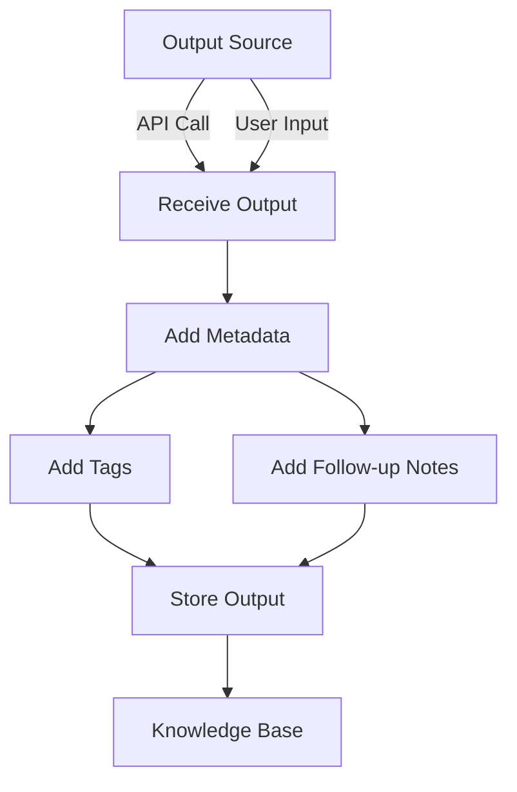
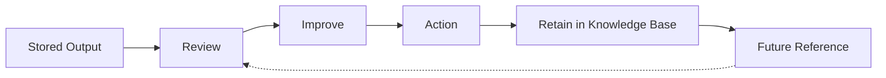
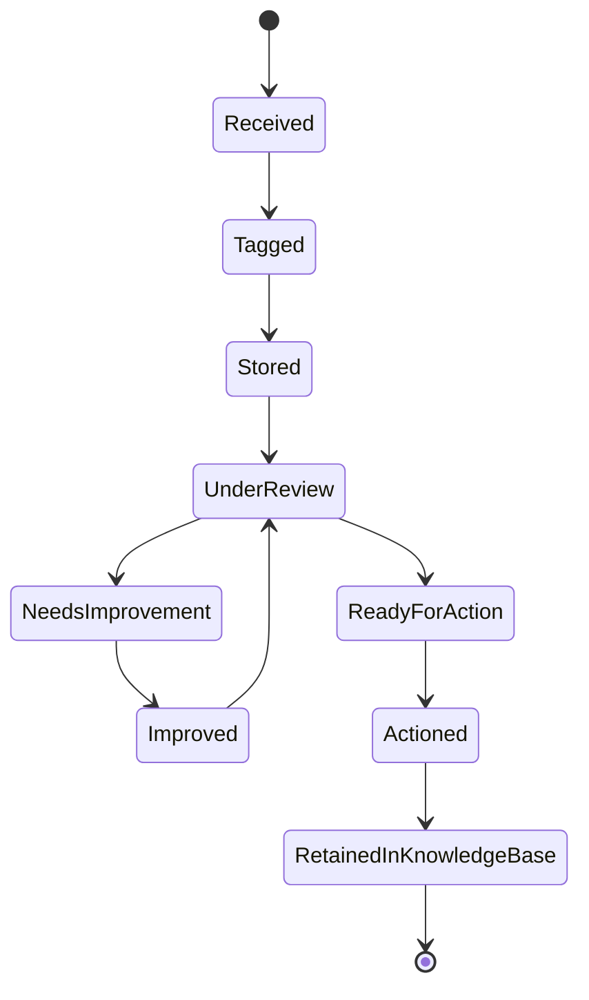
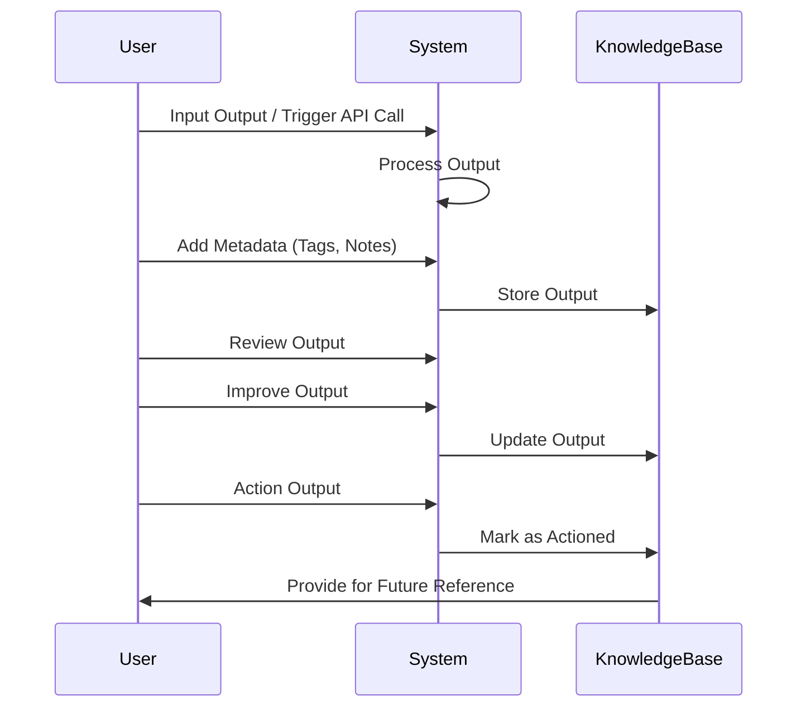

*Note: this repository consists of the outputs of large language models (LLMs). In many cases, these are unedited or minimally edited. The information provided is for demonstrative purposes only and is intended to highlight constraints and capabilities in LLM applications and prompt engineering strategies.*

# Prompt

Great. 
Please create a few codeblocks for diagrams that focus on how outputs are managed in the system

Outputs are either received from an API call or inputted by the user
Metadata like tags and follow up notes are added by the user
The output is stored
The output is reviewed
The output is improved upon
The output is actioned
The output is retained in the knowledge base

# Output

Certainly! I'll create a few Mermaid diagram codeblocks that focus on how outputs are managed in the Output Hub system, based on the workflow you've described. Here are the diagrams:

1. Output Creation and Initial Processing:

2. Output Lifecycle:

3. Output Management Process:

4. User Interaction with Outputs:

These diagrams illustrate the output management process in the Output Hub system, showing:

1. How outputs are created and initially processed, including metadata addition.
2. The lifecycle of an output from storage to retention in the knowledge base.
3. The various states an output can be in throughout its lifecycle.
4. The user's interaction with the system in managing outputs.

These visualizations should help users understand how outputs are handled, processed, and utilized within the Output Hub system, emphasizing the workflow from creation to retention in the knowledge base.

 

## Extracted Prompts
[[Prompts/Diagrams to show iterative output improvement.md#Prompt 1|Prompt 1]]
