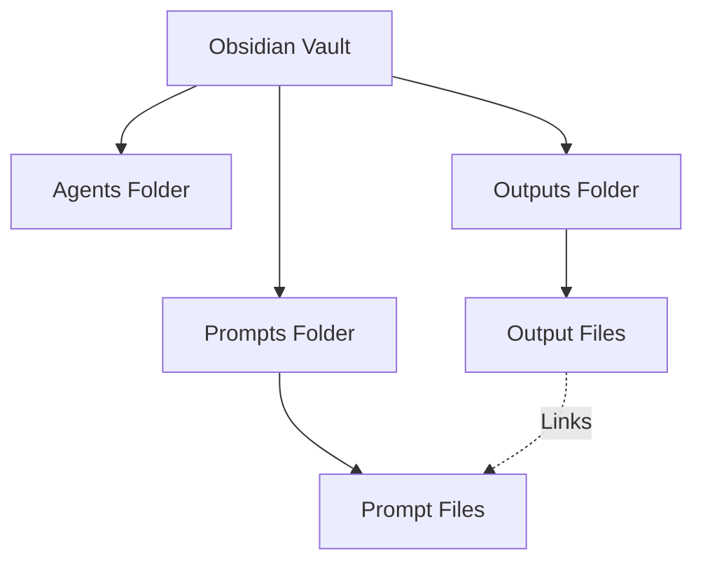
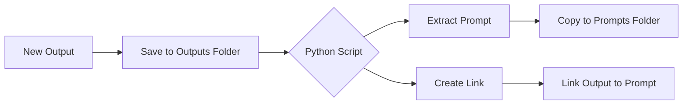
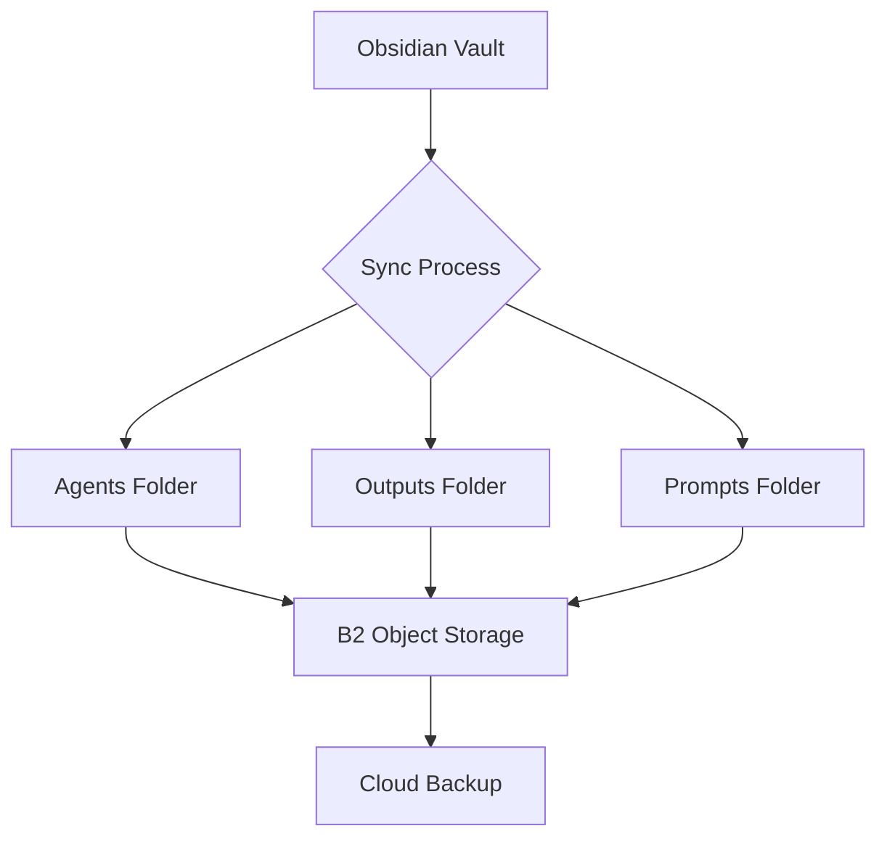
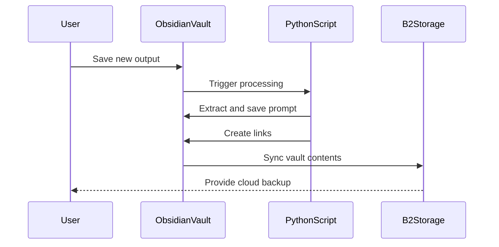

*Note: this repository consists of the outputs of large language models (LLMs). In many cases, these are unedited or minimally edited. The information provided is for demonstrative purposes only and is intended to highlight constraints and capabilities in LLM applications and prompt engineering strategies.*

# Prompt

Please create some mermaid diagrams that might help to explain how I'm using an Obsidian vault to store and manage LLM outputs. There are three core folders: agents, outputs, prompts When outputs are saved, the prompts are extracted and copied into the prompt library by a Python script Links are created between prompts and outputs The whole vault is synced to B2 object storage in the cloud

# Output

Certainly! I'll create some Mermaid diagrams to help explain how you're using an Obsidian vault to store and manage LLM outputs, based on the information you've provided. Here are the diagrams:

1. Obsidian Vault Structure:

This diagram shows the basic structure of your Obsidian vault with the three core folders and the links between outputs and prompts.

2. Output Processing Workflow:

This diagram illustrates the process of saving a new output, extracting the prompt, and creating links between them.

3. Sync Process with B2:

This diagram shows how the entire vault is synced to B2 object storage in the cloud.

4. Overall System Flow:

This sequence diagram shows the overall flow of the system, from saving a new output to syncing with B2 storage.

These diagrams provide a visual representation of how your Obsidian vault is structured and used to manage LLM outputs, including the process of extracting prompts, creating links, and syncing to B2 object storage.
 

## Extracted Prompts
[[Prompts/Obsidian output hub vault diagrams.md#Prompt 1|Prompt 1]]
